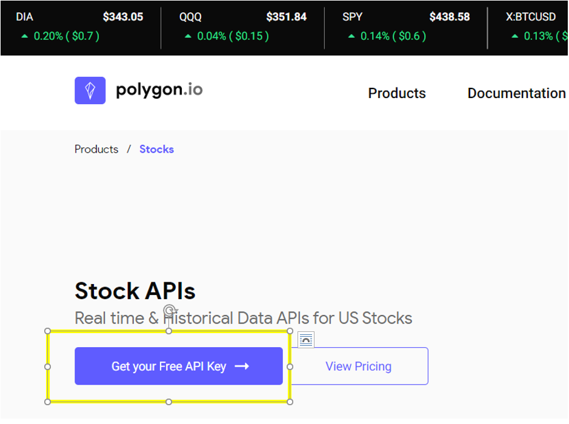

# Polygon_IO_API

*How to accessing polygon.io using Python*

## #1 Install Client

### pip install polygon-api-client

### polygon-api-client supports python version >= 3.6

# #2 'Free Key' Yourself

- Go to : https://polygon.io/stocks?gclid=EAIaIQobChMI8-qwqNTL9QIVFBvnCh1m_AR4EAAYASAAEgIBdPD_BwE



- Sign-up
- Create a config.py file to add key:
  key = "<your free key<your free key>>"
- Create starter code to validate usage:

```
import datetime
from polygon import RESTClient

def ts_to_datetime(ts) -> str:
return datetime.datetime.fromtimestamp(ts / 1000.0).strftime('%Y-%m-%d %H:%M')

#Accessing and display data from stock API.
def main():
key = "config.py"

#RESTClient can be used as a context manager to facilitate closing the underlying http session
#https://requests.readthedocs.io/en/master/user/advanced/#session-objects

with RESTClient(key) as client:
from_ = "2020-01-11"
to = "2021-01-15"
resp = client.stocks_equities_aggregates("AMD", 1440, "minute", from_, to, unadjusted=False)

print(f"Minute aggregates for {resp.ticker} between {from_} and {to}.")

for result in resp.results:
dt = ts_to_datetime(result['t'])
print(f"{dt}\n\tO: {result['o']}\n\tH: {result['h']}\n\tL: {result['l']}\n\tC: {result['c']} ")

if __name__ == '__main__':
main()
```

